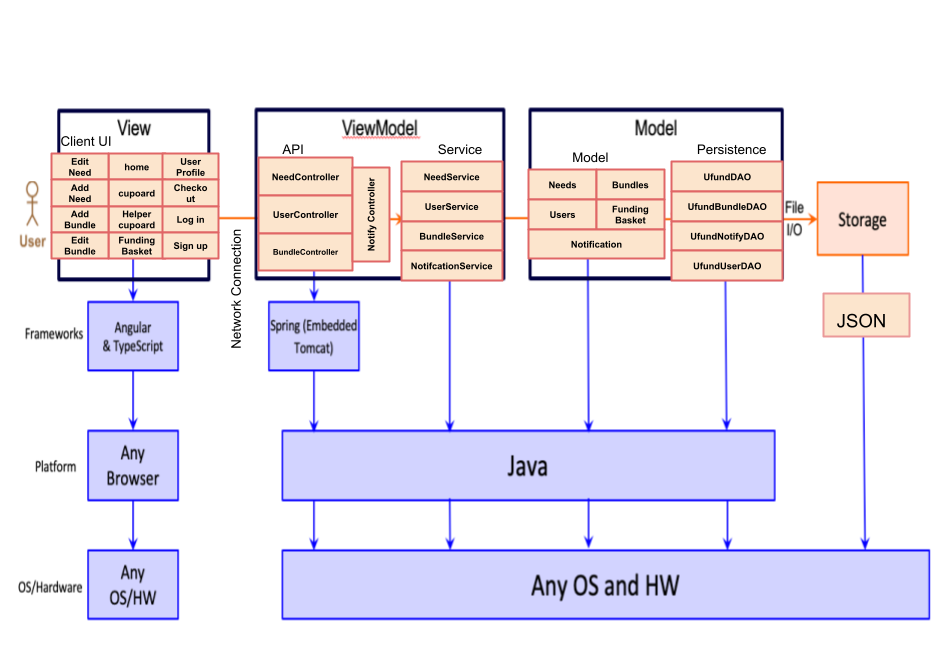

# PROJECT Design Documentation

## Team Information
* Team name: Duck Investments
* Team members:
  * Umaima Nisar
  * Katherine Bippus
  * Alex Lee
  * Abdelouakil Bouharrat
  * Tyler Knoxx

## Executive Summary
In essence, our proposal aims to empower users to make a tangible impact on the well-being of wild birds. This includes supporting causes such as habitat reconstruction, providing nutrition, and aiding birds affected by ecological disasters such as oil spills. Furthermore, our platform encourages individuals to actively participate as volunteers, engaging in activities such as litter control and tree planting to uplift local bird communities.

### Purpose
user goals: facilitate tangible contributions towards habitat reconstruction, providing nutrition to birds, assisting in the aftermath of ecological disasters like oil spills, and engaging in volunteer activities such as litter control and tree planting to improve local bird communities.
user group: individuals who are interested in wildlife conservation, specifically those who want to contribute to the welfare of endangered birds.

Sprint 4: the SWEN U-fund project aims to contribute to global wildlife conservation efforts through monetary gifts and donations towards habitat restoration, conservation ecology research, and disaster relief. The U-fund project will provide a streamlined platform through which individuals can contribute money and material goods and SWEN administration can clearly define their goals regarding donor support. The project will be tailored towards SWEN administration looking for an efficient and easy way to ask donors for support, as well as a larger user group interested in wildlife conservation who are looking for a way to channel their compassion for our feathered friends into real-world impact. 

### Glossary and Acronyms
| Term | Definition |
|------|------------|
| SPA | Single Page |
| MVP | minimum viable product |
| UI | User Interface |
| API | Application Programming Interface |
| MVVM | model view viewmodel |
| CURL | client uniform resource locator |
| CRUD | Create, Read, Update, Delete |

## Requirements

This section describes the features of the application.

### Definition of MVP
(SPRINT 2):
The minimum viable product should provide the ability to log in as a user or an admin, edit, add, or remove needs when logged in as admin, and perform several interactions with the cupboard as a user. These interactions should include: searching for needs based on title, adding needs to their funding basket, removing needs from their funding basket, viewing their funding basket, and saving the basket any time a change is made. Additionally, needs in the funding baskets should update based on admin input. New user accounts should be able to be created.

(SPRINT 4):
The minimum viable product includes the features which are absolutely essential to the project goals and functionality. It provides new users with a way to create an account and enters their new information into a user database. Returning users will be able to enter their username and password to have their credentials checked by the server, and, if the user exists and has the correct password, the user can log in and access their previous information. The admin should have a reserved username and password that allows them to access restricted sections of the site that allow them to add, remove, and edit organization needs. Both types of users should be able to search for specific needs by title. Non-admin users should have access to a funding basket and checkout page. They should be able to add needs to their funding basket or remove needs already in their funding basket. The contents of their funding basket should be saved to the database when changed. Provided they have needs in their funding basket and a valid amount of money in their account, they should be able to check out and contribute towards the needs in their funding basket. The admin and user should be aware when a need’s desired quantity has been met, and the admin should be able to see the surplus that was donated.

### MVP Features
Epics:
User Account Management: Implement functionality for new and returning users to create and manage their accounts(change username and password; delete profile)

Admin Access: Create restricted access for admin to manage and organize needs

Search and Listing: Develop a search feature for users to find a specific need based on the title

Funding Basket: Provide each user with a funding basket where they can add, manage and checkout items that require funding

Checkout and Payment: Designed a checkout system that allows users to contribute financially to their selected needs(can add money to their wallet on the site)

Donation Tracking: Track the donations and display the surplus amount to admin and user when the funding exceeds the need.

### Enhancements
Enhancement #1 (Bundles): We have made it so that the admin can create bundles of needs that they deem are related to each other. The users then can opt to donate towards a given bundle by adding the items inside the bundle to their funding basket.

Enhancement #2 (Notifications): The notification system helps the helpers stay up to date with what is going on on the site. These notifications can either be generated automatically whenever a need is added/deleted/edited/goes into surplus, or manually by the admin to let everyone know of general events that are happening in the community, such as announcements regarding the urgent need of a specific item.

## Application Domain

This section describes the application domain.

A user can login as either an admin or a helper
The admin has the ability to add/delete/edit needs in the cupboard but doesn't have a funding basket
A helper has a funding basket that they can add needs from the cupboard into, they can also checkout their fundings.

A user is either an admin or a helper. They can either log in or sign up. A helper has access to a funding basket and checkout, and can see the cupboard and add/remove items from their funding basket. They can check out and empty their funding basket. An admin can add, remove, or edit needs and bundles in the cupboard. They can create notifications. Users can see notifications, and add all the needs from a bundle to their funding basket.

## Architecture and Design

This section describes the application architecture.

### Summary

The following Tiers/Layers model shows a high-level view of the webapp's architecture. 

The web application, is built using the Model–View–ViewModel (MVVM) architecture pattern. 

The Model stores the application data objects including any functionality to provide persistance. 

The View is the client-side SPA built with Angular utilizing HTML, CSS and TypeScript. The ViewModel provides RESTful APIs to the client (View) as well as any logic required to manipulate the data objects from the Model.

Both the ViewModel and Model are built using Java and Spring Framework. Details of the components within these tiers are supplied below.

### Overview of User Interface

This section describes the web interface flow; this is how the user views and interacts with the web application.

### View Tier

 Sprint 4: The view tier contains a myriad of components responsible for various website functions. The first component displayed upon navigating to the site is the home page, which allows users to navigate to the login component or the sign up component. From the signup component, new users can create an account. Returning users can login using the login component. After logging in, helper-type users will be routed to the helper-cupboard component, responsible for displaying bundles and needs and adding them to helper funding baskets. A button within this component routes users to the funding basket, where they can route back to the helper cupboard, removed needs from the funding basket, or navigate to the checkout. From the checkout component, the user can check out and empty their funding basket. They may navigate back to the funding basket from this page. At the top of the screen they may use a router link to navigate to the user profile page, where they can edit their information. When logged in as an admin-type user, the admin will be routed to the cupboard component, which is inaccessible to regular users. From here they can see a list of needs and bundles as well as access the edit bundle and edit need components to alter existing needs and bundles. They can access the add bundle and add need components to add needs, which will be displayed on both the admin cupboard component and the helper-cupboard component. The admin can search for or remove needs directly from the cupboard component. The admin does not have access to the profile editor, checkout, or funding basket.

The diagram above illustrates the series of interactions within the system to facilitate the login user action. first, the login page component in the View recieves the user's request to log in, which converts the username and password into a user object and sends it to the API as an HTTP post request. The UserController interacts with the UFundDAOUsers, which reads and writes user objects to the file.
If the username does not exist, the DAO passes null, which is converted to a NOT_FOUND response entity by the Controller and sent to the Login Component, who displays an error message to the user.  
If the user exists, the DAO passes the user back to the Controller. The Controller validates the password.
If the password is incorrect, the Controller sends the user back with the CONFLICT status code, and the Login component recieves this and displays an error message. If the password is correct, the user is sent back in the body of a response entity with a status code of OK, and the LoginComponent records the active user in local storage and routes to the cupboardComponent if the user is the admin, or the helperCupboardComponent if the user is a helper.

This diagram showcases the ability for the UI to request and recieve Notifications from the Model Tier. Automatically upon logging in, the App Component requests that the NotificationService in the ViewModel tier gets notifications. Then, the NotificationService calls the Notification Controller in the API through a get HTTP request. The Notification Controller tells the UFundDAONotify to get all Notifications in the file. The DAO returns an array of all of these notification objects, and the Controller sends this array back to the Notifications service in the body of a response entity. The service informs the app component of updates to notifications, and the app component displays the list of notifications to the user (provided the notification display is toggled ON).

### ViewModel Tier
We have a class called need controller that will make it possible to search for a specific need, get a specific need, delete a specific need, create a new need,
update the needs, and get all the needs.

Sprint 4

Our ViewModel consists of two separate components, that being the API and the service. The Service links to the Controller over a network connection such that user input’s are converted into curl commands and sent to the API to be handled by the backend. In essence, the Service communicates with the backend while the controllers implement the logic behind the back end. The API consists of the NeedController which handles Need based commands, UserController which handles User commands, BundleController which deals with bundle logic, and the NotifyController which handles the logic behind notifications. Likewise each of these have an associated Service in the form of NeedService, UserService, BundleService, and NotificationService respectively. With this system in place users can interact with the backend via the front end. For instance, when the admin wants to edit a need they may interact with some element on the front end which sends the information to the NeedService. The NeedService will than convert the method into its respective CURL command and send that to the NeedController which will map it to its internal method to handle the request

### Model Tier

SPRINT 1: There is the Need class which set and get properties of a need, and to check if the goal is met.

SPRINT 2: In addition to the Needcontroller and FileDAO, the model tier has been updated to facilitate the creation of users and their interactions with funding baskets. The User class is responsible for the creation of user objects and provides JSON mapping. The Fundingbasket class serves as a container of needs that can be stored by the user and written to the file. The UfundUserDAO is responsible for writing user objects to the file, editing users in the file, and retrieving the data for other applications.

SPRINT 3: in addition to the systems previously addressed, the model now handles Bundles and Notifications, and has been updated accordingly. There exists a Notification class, responsible for the creation of notifications and their data, and provides JSON mapping. There is a UFundNotifyDAO which reads and writes Notification objects to and from the JSON file. A NotificationController handles http requests regarding CRUD commands to create, remove, update, delete, and uses the DAO to make appropriate changes/operations. A Bundle class exists that is responsible for creating Bundle objects with a name, id, and needlist and provides JSON mapping. The UFundBundleDAO reads and writes these Bundle objects to a JSON file. The BundleController handles http requests and uses the DAO to alter/read from the file accordingly.

Sprint 4: Not much has changed since the implementation of sprint 3. To give a general overview of the Model architecture, our models within the model include Needs, Bundles, Users, Funding Basket, and Notifications which all link to our Persistence which includes our UFundDAo, UFundBundleDAO, UFundNotifyDAO, and UfundUserDAO. The needs provide the general information about what needs are desired within our ufund while Users stores our users actual informations including their Funding Basket. Bundles contain collections of Needs and our Notifications contain the basic information of a given notification from either a system event or an admin creation. Using http request to map CURL commands to implementations for our persistence classes such that we can update specific models. For instance UFundDAO handles Need based commands, UFundBundleDAO handles bundles, UFundNotifyDAO handles notifications, and UFundUserDAO handles user commands. 

## OO Design Principles

single responsibility - Each class should have one purpose, making it easier to maintain.
low coupling - Minimize dependencies between classes for easier modifications and better modularity.
dependency inversion - High-level modules should not depend on low-level ones; both should rely on abstractions, promoting decoupling and flexibility.

Injection - we have utilized injection to make it so different classes use other classes to achieve a specific goal, some of the notable ones are the controllers using DAOs to be able to save and load data from a JSON file.

Information expert - we have made it so that only classes containing information are allowed to use the information, other classes would have to request they need be done to that information, for example: on the model and the viewmodel tiers, controllers don’t know what is in the .json files, they request the DAOs to do the job of giving them that information. Also, on the view tier angular components on the UI side call different requests from the angular services that are designed to make curl requests, edit local storage and handle other services.

Sprint 4: 

Low coupling - lowering the amount of dependencies between the classes for easier editing of the code. This can be seen in the controllers calling the DAO methods that in turn call the fileDAOs which are responsible for the persistence part of the application.
	
Single responsibility - It is when each class is supposed to do its job and its job only. Can be found in FileDAOs only being responsible for handling persistence, controllers managing REST API commands, services being responsible for general UI functionalities while the components are responsible for user interactions.
 
Dependency Inversion (Injection) - different classes can import other classes to better do their job, so that not all classes would be responsible for more than they should. Can be seen on controllers injecting DAOs on the API side, and on components injecting services on the UI side. 

Information Expert - This is where only the classes with access to specific information are allowed to use that information. Other classes can invoke interactions with them in order to get what they need done. For example: on the model and the viewmodel tiers, controllers don’t know what is in the .json files, they request the DAOs to do the job of giving them that information. Also, on the view tier angular components on the UI side call different requests from the angular services that are designed to make curl requests, edit local storage and handle other services.

Pure fabrication - A pure fabrication is a class created solely to preserve single responsibility and low coupling and is not present in the problem domain. The typescript services NeedService, UserService, BundleService, and NotificationService are examples of pure fabrications, responsible for facilitating communications between the UI and API, but are not instantiable classes.

Controller - A controller is the mechanism that links between the UI and the model of the application. We have implemented various controllers that process CRUD operations for the different entities within the API, including the NeedController, BundleController, NotificationController, and UserControllers. 

## Static Code Analysis/Future Design Improvements

1. One area we could improve our code on is the reliability within he UI, by adding in a general font family, operating systems without our specified font will use a default font within the provided font family. 

2. Another area we could improve is the complexity of our nesting within both our UI and API. By using more logical operators and separating nested statements using other methods, we can reduce the amount of complexity it takes to trace through our code as well as improve future maintainability. 

3. Finally, our API includes 1 potential bug within it as we implement an equals method for the Bundles Class however, there is no hashcode. This doesn’t necessarily hurt the code as we never use the hashcode to id a bundle, however, this does hurt the potential speed of any data structures that use the hashing function. 

## Testing

### Acceptance Testing

Sprint 2:
User stories with all acceptance criteria passed: 16
User stories with some acceptance criteria failing: 0
User stories without any testing: 5
No issues during acceptance testing except for delays between teammates.

Sprint 4:
User stories with all acceptance criteria passed: 56
User stories with some accetpance criteria failing: 0
User stories without any testing: 0
No major issues during acceptance testing that could other than minor edge cases 
that were able to be fixed quickly. 

### Unit Testing and Code Coverage

(Sprint 2) UserController is barely touched and requires a much more thorough series of tests.
however,  our Funding Basket still needs to be tested much more heavily.
UFundFileDAO appears to not be covering particular methods that there are calls to. This seems to be attributed to many missed branches, but will have to be changed for later tests, so that it covers more of the function call.

(Sprint 3) 
For the most part our coverage report was fairly stable. Most tests covered the application fully and tested every branch. There were only a few problems on the controller tier which covered less than the model and persistence tiers mainly due to some missed instructions in user controller for example. There have also been many branches missed on the controllers side.

## Ongoing Rationale

2024/02/19: We finished our demo and completed our code.
**(2024/02/19): We finished our demo and completed our code.
**(2024/3/18): Sprint 2: We have developed a minimum viable product with a simple user interface. 

Sprint-3 (2024/03/28) enhancement features proposed: Notifications – useful for informing users of changes to the cupboard: Bundles: provides a means for grouping needs, useful for grouping items that will be used for the same purpose, ie, a fundraiser that requires x, y, and z
Sprint-3 (2024/03/30) enhancement features greenlit
Sprint-3 (2024/04/2): enhancement features implemented

Sprint-4 (2024/04/15): updated design doc to prepare for transition phase, reviewed and updated diagrams
Sprint-4 (2024/04/12): Got the static code Analyis fully done one at least 2 machines. 
Sprint-4 (2024/04/16): Finished the Presentation and updated design doc

